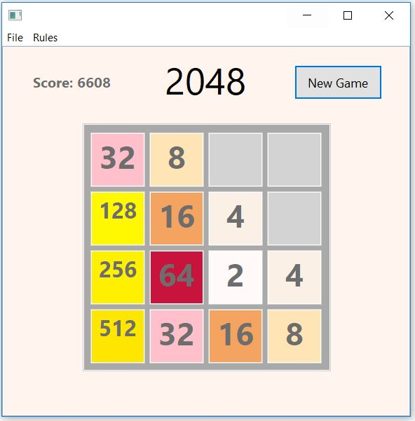

# 2048
My own take on the popular game 2048

The objective of the game is to get the number 2048 using additions of the number two and its multiples.  Use the arrow keys to move up or down, left or right trying to join two equal numbers.  When two equal numbers are in touch, they will add up. Each time you make a move, a new 2 or 4 will appear on the board. Try to get to 2048!
# Project Screen Shots

# Download Instructions
**Requirements:**

* You must have JRE (Java Runtime Environment) installed on your machine.                                                                                                                                                            
→  http://www.oracle.com/technetwork/java/javase/downloads/jre8-downloads-2133155.html

**Instructions:**
* Clone this repository, or manually download 2048.jar from the master branch
* Run 2048.jar
